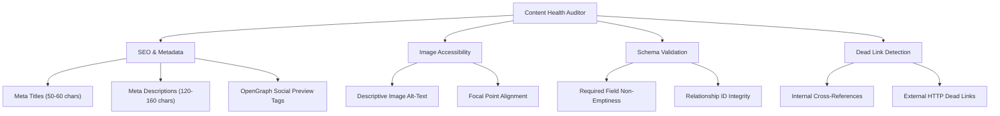

# Content Health & SEO Quality Auditor

The **Content Health & Quality Auditor** is an autonomous scanning subsystem integrated into Kyro CMS. It continuously evaluates documents across registered collections to detect incomplete metadata, missing image alt-texts, broken references, and non-compliant fields before content is published or deployed.

## Diagnostic Categories

The auditor examines documents across four core quality vectors:



### 1. SEO & Social Metadata
- **Meta Title Check**: Verifies presence and optimal length (between 40 and 65 characters).
- **Meta Description Check**: Flags missing descriptions or lengths outside the optimal 120–160 character snippet window.
- **OpenGraph & Twitter Cards**: Validates presence of `og:title`, `og:description`, and `og:image`.

### 2. Image Accessibility
- **Descriptive Alt-Text**: Scans all `upload` and `media` field values to verify descriptive text is provided.
- **AI Alt-Text Integration**: Works directly with the Vision AI plugin in `@kyro-cms/ai` to offer one-click remediation.

### 3. Schema & Constraint Validation
- **Required Fields**: Detects empty strings or null values stored in fields marked `required: true`.
- **Relationship Integrity**: Confirms referenced document IDs exist in their target collections and have not been orphaned.

### 4. Dead Link Detection
- **Internal Cross-References**: Flags broken internal slug paths or deleted referenced entries.

## Admin Dashboard Interface

The audit dashboard is available in the Kyro Admin panel at `/admin/content-health` (or under the **Security & Monitoring** / **Dashboard** navigation).

### Key Dashboard Sections

1. **Overall Health Status Banner**: Displays global repository health percentage and high-level health state (Optimal vs. Action Required).
2. **Four-Metric Grid**:
   - **Quality Score**: Weighted aggregate score across all documents.
   - **Scanned Docs**: Total count of evaluated documents.
   - **Active Issues**: Number of warning or critical issues identified.
   - **Perfect Docs**: Count of documents meeting 100% compliance.
3. **Category Diagnostics Card**: Breakdown of compliance percentages by category (*SEO & Metadata*, *Image Accessibility*, *Schema Validation*, *Dead Link Detection*).
4. **Actionable Issues Feed**: Filterable list of specific document defects, including:
   - Defect type badge (`seo`, `accessibility`, `validation`).
   - Collection slug and document title.
   - Actionable recommendation copy.
   - Direct **Fix** button that navigates to the document editor form.

## Programmatic Auditing

You can invoke the content auditor programmatically in custom scripts, background cron jobs, or CI/CD pipelines:

```typescript
import { auditContentHealth } from "@kyro-cms/core";
import config from "./kyro.config";

async function runHealthCheck() {
  // Fetch collection data from your database adapter
  const auditResult = await auditContentHealth({
    collections: config.collections,
    fetchDocuments: async (collectionSlug) => {
      // Return array of documents for collection
      return await myDatabaseAdapter.find(collectionSlug);
    },
  });

  console.log(`Content Health Score: ${auditResult.score}%`);
  console.log(`Total Issues Found: ${auditResult.issues.length}`);

  for (const issue of auditResult.issues) {
    console.warn(`[${issue.severity.toUpperCase()}] ${issue.collection}/${issue.documentId}: ${issue.message}`);
  }

  if (auditResult.score < 80) {
    process.exit(1); // Fail CI build if content quality drops below threshold
  }
}

runHealthCheck();
```

## Audit Result Interface

```typescript
export interface AuditReport {
  score: number; // 0 to 100
  totalDocuments: number;
  scannedAt: string; // ISO 8601 timestamp
  issues: Array<{
    id: string;
    type: "seo" | "accessibility" | "validation" | "link";
    severity: "critical" | "warning" | "info";
    collection: string;
    documentId: string;
    documentTitle?: string;
    field?: string;
    message: string;
    recommendation?: string;
  }>;
  categories: {
    seo: number;
    accessibility: number;
    validation: number;
    links: number;
  };
}
```
