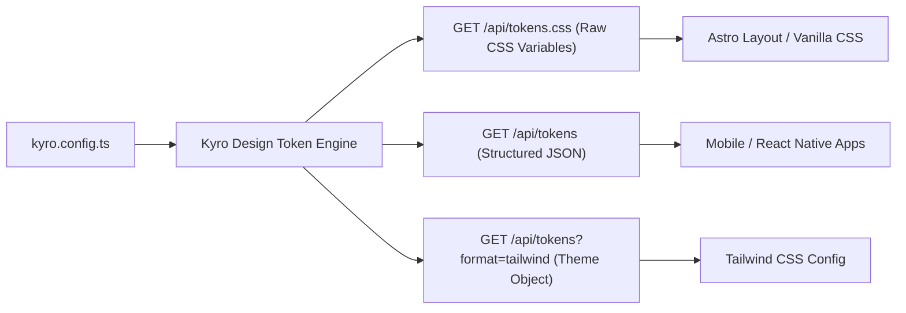

# Design Token Synchronization

Kyro CMS provides a built-in **Design Token Synchronization Engine** that bridges the gap between content management and frontend styling systems. Instead of hardcoding color hex codes, font families, and border radii in your frontend repository, you can manage them centrally in Kyro and consume them in real time across Astro, Tailwind CSS, or Vanilla CSS.

## Architecture



## Configuring Tokens in `kyro.config.ts`

Tokens can be defined under the `styling` or `theme` block in your `kyro.config.ts`:

```typescript
import { defineKyroConfig } from "@kyro-cms/core";
import { createLocalAdapter } from "@kyro-cms/core/database";

export default defineKyroConfig({
  database: createLocalAdapter({ path: "./data/kyro.db" }),
  
  // Design tokens definition
  styling: {
    colors: {
      primary: "#10b981",
      primaryHover: "#059669",
      secondary: "#6366f1",
      background: "#09090b",
      surface: "#18181b",
      surfaceAccent: "#27272a",
      border: "#27272a",
      textPrimary: "#fafafa",
      textSecondary: "#a1a1aa",
      textMuted: "#71717a",
      accent: "#f59e0b",
    },
    typography: {
      fontFamilySans: "'Inter', system-ui, sans-serif",
      fontFamilyMono: "'JetBrains Mono', monospace",
      fontSizeBase: "16px",
      lineHeightBase: "1.6",
    },
    spacing: {
      containerPadding: "1.5rem",
      sectionGap: "4rem",
      cardPadding: "1.25rem",
    },
    radii: {
      sm: "0.375rem",
      md: "0.5rem",
      lg: "0.75rem",
      xl: "1rem",
      full: "9999px",
    },
  },

  collections: [
    // ...
  ],
});
```

## API Endpoints

The core engine exposes three endpoints for consuming design tokens:

### 1. `GET /api/tokens.css`

Returns raw CSS custom properties formatted for direct inclusion into an HTML `<head>` or stylesheet.

**Sample Response:**

```css
:root {
  --kyro-color-primary: #10b981;
  --kyro-color-primary-hover: #059669;
  --kyro-color-secondary: #6366f1;
  --kyro-color-background: #09090b;
  --kyro-color-surface: #18181b;
  --kyro-color-surface-accent: #27272a;
  --kyro-color-border: #27272a;
  --kyro-color-text-primary: #fafafa;
  --kyro-color-text-secondary: #a1a1aa;
  --kyro-color-text-muted: #71717a;
  --kyro-color-accent: #f59e0b;
  --kyro-font-sans: 'Inter', system-ui, sans-serif;
  --kyro-font-mono: 'JetBrains Mono', monospace;
  --kyro-font-size-base: 16px;
  --kyro-line-height-base: 1.6;
  --kyro-radius-sm: 0.375rem;
  --kyro-radius-md: 0.5rem;
  --kyro-radius-lg: 0.75rem;
  --kyro-radius-xl: 1rem;
  --kyro-radius-full: 9999px;
}
```

### 2. `GET /api/tokens`

Returns a structured JSON representation of the active token tree.

**Sample Request:**

```bash
curl http://localhost:4321/api/tokens
```

**Sample Response:**

```json
{
  "colors": {
    "primary": "#10b981",
    "background": "#09090b",
    "surface": "#18181b"
  },
  "typography": {
    "fontFamilySans": "'Inter', system-ui, sans-serif"
  },
  "radii": {
    "lg": "0.75rem"
  }
}
```

### 3. `GET /api/tokens?format=tailwind`

Returns a JSON object formatted specifically for extending Tailwind CSS theme configurations.

## Frontend Integrations

### Astro Integration (CSS Variables)

To apply tokens globally across your Astro site, link the stylesheet in your root layout:

```astro
---
// src/layouts/BaseLayout.astro
interface Props {
  title: string;
}

const { title } = Astro.props;
const apiUrl = import.meta.env.PUBLIC_KYRO_API_URL || "http://localhost:4321/api";
---

<!doctype html>
<html lang="en">
  <head>
    <meta charset="UTF-8" />
    <meta name="viewport" content="width=device-width, initial-scale=1.0" />
    <title>{title}</title>

    <!-- Synchronize design tokens from Kyro -->
    <link rel="stylesheet" href={`${apiUrl}/tokens.css`} />
  </head>
  <body class="bg-[var(--kyro-color-background)] text-[var(--kyro-color-text-primary)]">
    <slot />
  </body>
</html>
```

### Tailwind CSS Integration

You can configure Tailwind CSS to reference Kyro CSS variables directly in `tailwind.config.mjs`:

```javascript
// tailwind.config.mjs
/** @type {import('tailwindcss').Config} */
export default {
  content: ["./src/**/*.{astro,html,js,jsx,md,mdx,svelte,ts,tsx,vue}"],
  theme: {
    extend: {
      colors: {
        kyro: {
          primary: "var(--kyro-color-primary)",
          "primary-hover": "var(--kyro-color-primary-hover)",
          secondary: "var(--kyro-color-secondary)",
          bg: "var(--kyro-color-background)",
          surface: "var(--kyro-color-surface)",
          "surface-accent": "var(--kyro-color-surface-accent)",
          border: "var(--kyro-color-border)",
          text: "var(--kyro-color-text-primary)",
          "text-muted": "var(--kyro-color-text-muted)",
        },
      },
      borderRadius: {
        "kyro-sm": "var(--kyro-radius-sm)",
        "kyro-md": "var(--kyro-radius-md)",
        "kyro-lg": "var(--kyro-radius-lg)",
        "kyro-xl": "var(--kyro-radius-xl)",
      },
      fontFamily: {
        sans: ["var(--kyro-font-sans)"],
        mono: ["var(--kyro-font-mono)"],
      },
    },
  },
  plugins: [],
};
```

**Usage in Components:**

```astro
<div class="bg-kyro-surface border border-kyro-border rounded-kyro-lg p-6">
  <h2 class="text-xl font-bold text-kyro-text">Live Synchronized Component</h2>
  <p class="text-kyro-text-muted mt-2">
    Styles adapt automatically whenever tokens change in kyro.config.ts.
  </p>
  <button class="mt-4 px-4 py-2 bg-kyro-primary hover:bg-kyro-primary-hover text-white rounded-kyro-md font-medium">
    Action Button
  </button>
</div>
```

## Programmatic Token Extraction

If you need to extract or serialize tokens within custom Node.js build scripts:

```typescript
import { extractDesignTokens, exportTokensAsCss, exportTokensAsTailwind } from "@kyro-cms/core";
import config from "./kyro.config";

const tokens = extractDesignTokens(config);
const cssString = exportTokensAsCss(tokens);
const tailwindTheme = exportTokensAsTailwind(tokens);
```
