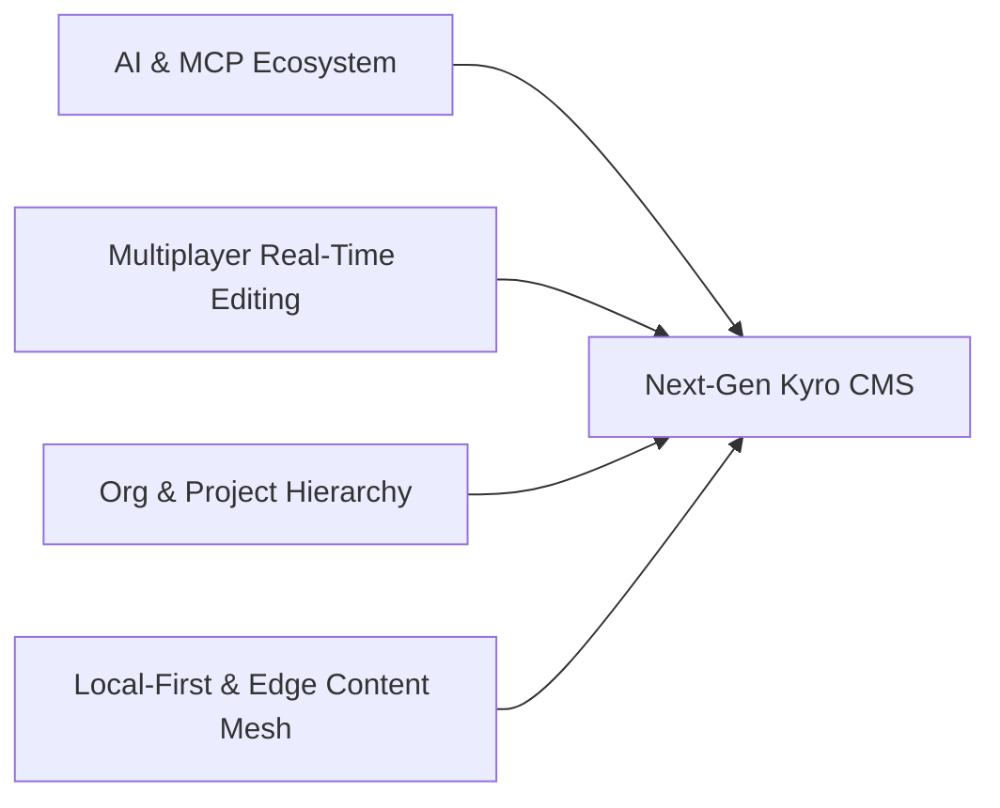

# Kyro CMS — Product & Innovation Roadmap

Welcome to the future roadmap for Kyro CMS. Having achieved our core foundation — multi-database adapters, multi-protocol APIs (REST, GraphQL, tRPC, WebSockets), high-performance batched relationship engine, zero-latency access control, and native Astro integration — our focus transitions toward full AI adoption & MCP server ecosystem, multi-user real-time collaboration (multiplayer CMS), enterprise project & organization hierarchy, and agentic content workflows.

---

## Strategic Pillars



---

## 1. Multi-User Real-Time Collaboration (Multiplayer CMS)

Bringing concurrent editing, presence, and editorial workflows directly into the Kyro Admin Dashboard.

### Live Concurrent Editing (CRDTs & Yjs)
- [ ] **Conflict-Free Character & Block Sync**: Powering Kyro RichText (TipTap/Slate) and structured form fields with Yjs CRDTs over Kyro's native WebSocket engine.
- [ ] **Simultaneous Multi-Author Editing**: Multiple editors can write, format, rearrange blocks, and tweak media in the exact same document at the same time without race conditions or overwrite data loss.

### Live Presence, Cursors & Awareness
- [x] **Active User Avatars & Status**: Real-time user avatar stack showing everyone actively viewing or modifying a document (`CollaboratorAvatars.tsx`).
- [ ] **Live Colored Cursors & Selection Highlighting**: See peer cursor positions, active text selections, and focused form inputs in real time.
- [x] **Field Awareness Indicators**: Visual glow and avatar badges next to fields indicating who is editing what.

### Collaboration Control Modes
- [ ] **Free Collaborative Mode (Default)**: Full real-time multiplayer editing across all fields.
- [ ] **Soft / Strict Field Locking**: Optional configuration to lock entire fields or repeater rows to one editor while active, releasing immediately upon blur or timeout.

### In-Context Comments, Threads & Mentions
- [ ] **Block & Text-Level Annotations**: Attach review comments to specific paragraphs, rich-text selections, media assets, or structured fields.
- [ ] **Team Mentions**: Tag team members with automatic email and webhook notifications.
- [ ] **Thread Management**: Resolve, reopen, and filter comment threads during the editorial review lifecycle.

### Attribution & Live Visual Diffs
- [x] **Per-Contributor Attribution & Revisions**: Granular history tracking showing exact line/block contributions per user (`AutoFormVersionView.tsx`).
- [ ] **Live Branching & Staged Co-Authoring**: Collaborative draft staging with review requests and approval gating before publishing to production.

---

## 2. AI Adoption & Kyro MCP Server

Transforming Kyro into an intelligent, agentic content engine that seamlessly interfaces with human teams and AI coding assistants.

### Official Kyro MCP Server (`@kyro-cms/mcp`)
A first-class Model Context Protocol (MCP) server empowering AI tools (Claude Desktop, Cursor, Antigravity, GitHub Copilot) to interact natively with Kyro CMS:
- [x] **Tools**:
  - `get_schema`: Introspect collections, field definitions, validation rules, and relations.
  - `query_collection`: Execute type-safe filter, sort, pagination, and populate queries.
  - `mutate_document`: Create, update, draft, or delete collection documents.
  - `generate_astro_component`: Scaffold Astro components & Content Layer loaders tailored to existing collection schemas.
  - `diff_and_migrate_schema`: Compare live database schemas against `kyro.config.ts` and generate migration plans.
  - `validate_config`: Automated static analysis and validation of Kyro configuration files.
- [x] **Resources**:
  - Dynamic URIs (`kyro://collections/{slug}`, `kyro://globals/{slug}`, `kyro://media/{id}`) providing live context directly into LLM prompts.
- [x] **Prompts**:
  - Curated workflows for schema design, field strategy authoring, lifecycle hook pipelines, and SEO optimization.

### Intelligent Editorial Co-Pilot (`@kyro-cms/ai`)
- [ ] **Context-Aware RichText Assistant**: Embedded inline generation, tone switching, fact-checking, automated summaries, and key takeaways inside TipTap / Block editor.
- [ ] **Multilingual Instant Localization**: One-click AI translation preserving Markdown/RichText formatting and localized slug generation.
- [x] **Vision AI in Media Manager**:
  - Automated descriptive alt-text and accessibility captions generation (`generateImageAltText`, button in `MediaGallery.tsx`).
  - Semantic asset tagging and dominant color palette extraction.
  - Focal point detection for responsive thumbnail cropping (`ImageFocalEditor.tsx`).
- [ ] **Natural Language Admin Query & Search**:
  - Chat-driven data exploration (*"Show me all draft blog posts created by Sarah last month with missing SEO descriptions"*).
- [x] **Prompt-to-Schema Synthesis**:
  - Generate complete, production-ready `kyro.config.ts` collection schemas from natural language prompts directly within the Admin UI (`generateKyroSchemaFromPrompt`, `PromptModal.tsx`).
- [x] **AI Auto-SEO 2.0 Plugin**:
  - Automated meta title, description, and OpenGraph social preview tags in `@kyro-cms/ai`.

### Vector Search & RAG-Native Embeddings
- [x] **Native Embedding Field Type**:
  ```ts
  {
    name: 'embedding',
    type: 'embedding',
    sourceField: 'content',
    provider: 'openai', // or 'cohere', 'local-fastembed'
    dimensions: 1536
  }
  ```
- [x] **Automatic Vector Pipeline**: Background hook generation of vector embeddings on document create/update (`AiVectorPlugin`).
- [x] **Semantic Query Endpoints**: Integrated vector similarity search endpoint (`/api/:collection/semantic-search`) over REST, tRPC, and GraphQL for instant semantic search and recommendations in Astro sites.

---

## 3. Organizations, Projects & Virtual Folder Hierarchy

Scaling Kyro from single-site configurations to enterprise-grade multi-project governance and structured content architecture.

### Organizations & Multi-Tenancy
- [x] **Organization Workspaces & Project Hub**: Centralized management for companies, agencies, and teams with workspace switching, environment tagging (Production, Staging, Development), and global settings.
- [x] **Granular Organization & Field RBAC**: Role-based access and per-field read/update/create access control rules with zero-latency field masking (`maskRestrictedFields`).
- [x] **Single Sign-On (SSO)**: SAML 2.0 / OIDC enterprise authentication integration (Okta, Google Workspace, Azure AD).

### Multi-Project Governance & Environments
- [x] **Multi-Project Hub**: Create, switch, and manage multiple decoupled or interconnected projects within one organization.
- [x] **Stage Environments**: Branching between development, staging, and production environments with environment status tagging.
- [ ] **Cross-Project Content Sharing**: Shared media repositories, component libraries, and read-only cross-project collection references.

### Virtual Folder Grouping & Taxonomy Management
- [x] **Hierarchical Virtual Folders**: Organize collections, globals, and media assets into nested virtual folders in the Admin sidebar without breaking database schema structures.
- [x] **Smart Dynamic Folders & Content Quality Auditor**: Real-time content health scanner inspecting collections for missing SEO tags, empty alt-texts, and schema gaps with dedicated dashboard (`/admin/content-health`).
- [x] **Nested Document Trees**: First-class support for hierarchical page structures (parent-child page trees in `ListView.tsx`, interactive breadcrumbs in `AutoFormHeader.tsx`).
- [ ] **Drag-and-Drop Organization**: Reorder, nest, and regroup documents, collections, and media assets.

---

## 4. Future Horizons & Next-Gen Innovations

### Local-First & Edge-Replicated CMS
- [ ] **Offline-First PWA Admin**: Full admin dashboard functionality offline with local IndexedDB/WASM SQLite caching and automatic background synchronization upon reconnection.
- [ ] **Edge Data Replication**: Direct integration with Turso (libSQL), Cloudflare D1, and Neon Postgres edge caching for low-latency global content delivery.

### Visual Canvas & Astro Live Builder 2.0
- [ ] **Interactive Astro Island Canvas**: Live preview that allows direct on-page visual editing with bi-directional Astro code sync.
- [x] **Design Token Synchronization Engine**: Centralized design tokens (colors, typography, spacing, border radii) manageable in Kyro and consumed dynamically by Astro & Tailwind frontends via `/api/tokens` and `/api/tokens.css`.

### Autonomous Content Agents & Pipelines
- [x] **Content Health & Quality Auditor Agent**: Deep audit for missing SEO descriptions, unoptimized media assets, and empty required fields.
- [ ] **Scheduled Agentic Workflows**: Autonomous background agents that audit dead links, verify outdated pricing/specs, curate weekly roundup posts, and suggest SEO improvements.
- [ ] **Webhook Agent Triggers**: Trigger external LLM agent workflows on document lifecycle events (publish, archive, revise).

### Universal Content Mesh
- [ ] **Federated API Stitching**: Merge Kyro collection schemas with external third-party GraphQL/REST APIs (Shopify, Stripe, Supabase) into a single unified client SDK (`@kyro-cms/connect`).

---

## Roadmap Horizons

| Phase | Milestone | Key Deliverables | Status |
| :--- | :--- | :--- | :--- |
| **Phase 1 (Near-Term)** | **AI Engine & MCP Server** | `@kyro-cms/mcp` Server, AI Auto-SEO 2.0, Vision AI in Media Manager, Prompt-to-Schema generator. | **COMPLETED** |
| **Phase 2 (Mid-Term)** | **Multiplayer Presence & Collab** | Collaborator presence avatars, field-awareness badges, revision history visual diffs, Yjs TipTap CRDT. | **IN PROGRESS** |
| **Phase 3 (Expansion)** | **Orgs, Projects & Virtual Trees** | Workspace/Project switcher, Stage environments, Parent-child Document Trees & Breadcrumbs, Content Health Auditor. | **COMPLETED** |
| **Phase 4 (Long-Term)** | **Vector RAG & Granular RBAC** | Native `embedding` field type, Vector similarity search API (`/semantic-search`), Field-level RBAC access hooks & masking. | **COMPLETED** |
| **Phase 5 (Future Vision)** | **Design Token Sync & Agentic Mesh** | Live Design Token endpoints (`/api/tokens.css`), Astro Visual Canvas, Scheduled Agent Workflows. | **IN PROGRESS** |

---

*Suggestions or feedback? Join our GitHub Discussions or contribute to Kyro CMS on [GitHub](https://github.com/danielDozie/kyro-cms).*
